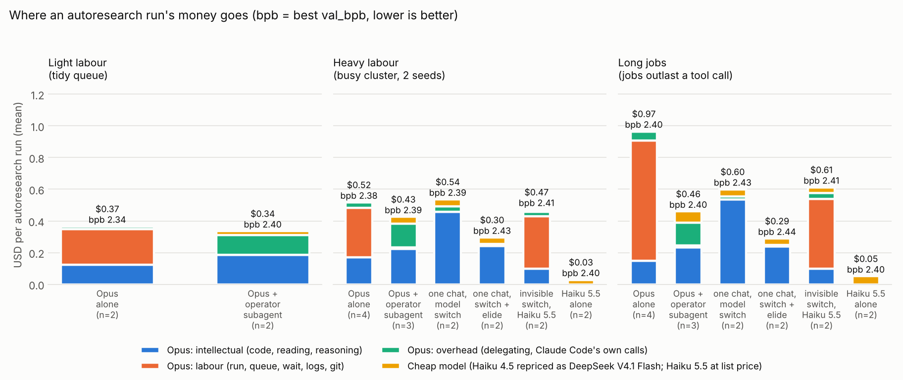

# token-marxing

> *From each model according to its price, to each task according to its difficulty.*

When Claude Code runs an autoresearch loop, Opus spends most of its money on **labour**:
running `.py` files, e2e checks, queueing jobs, waiting for jobs, reading logs, `git`.
token-marxing hands that labour to a cheap model (Claude Haiku 5.5, DeepSeek V4.1 Flash, ...)
**inside the same chat**, and keeps Opus for the **intellectual work**: deciding what to try and
writing the PyTorch code.

**[`marx/router.py`](marx/router.py)** is a stdlib-only proxy that you point `ANTHROPIC_BASE_URL` at.
It picks the model that answers each turn of one Claude Code conversation, and writes a per-call
usage and cost ledger, which is how every number below was measured. It switches in one of two
ways:

- **Invisible switching** (`routes.dispatch*.json`): the agent gets ordinary instructions and is
  never told about models or switching. Before each turn, a tiny classifier call to Haiku 5.5
  ([`marx/dispatch.py`](marx/dispatch.py)) decides whether the next step is a judgment call
  (Opus) or routine execution (the cheap model).
- **Explicit hand-offs** (`routes.switch*.json`): the agent itself runs `marx-mode labour "…"`
  to give the next turns to the cheap model, and `marx-mode think "<report>"` to take them back.
  With **elide**, Opus sees each labour stretch as just the operator's report.

For comparison, the repo also has a subagent version
([`claude/agents/operator.md`](claude/agents/operator.md)) and an inverted version (a cheap driver
calling an Opus researcher).

## Update: Claude Haiku 5.5

Haiku 5.5 was released in October 2026, at **$0.10/M input, $0.50/M output and $0.01/M cache
hits** for prompts up to 100k tokens (5x above that). That's 10x below Haiku 4.5, and below
DeepSeek V4.1 Flash's peak rates. It takes Claude Code's Opus-shaped requests unmodified. These
runs use it at its real price, on the heavy and long-jobs conditions described below. Mean $ per
run:

| | heavy | long jobs | best val_bpb (all runs) |
|---|---|---|---|
| Opus alone | $0.52 | $0.97 | 2.34-2.43 |
| Invisible switching, Opus + Haiku 5.5 | $0.47 (−10%) | $0.61 (−37%) | 2.40-2.42 |
| Explicit hand-offs + elide (Haiku 4.5 priced as DeepSeek, earlier runs) | $0.30 | $0.29 | 2.43-2.44 |
| **Haiku 5.5 alone** | **$0.03** | **$0.05** | **2.37-2.42** |

- **On this task, Haiku 5.5 alone is as good as Opus, for 1/15-1/20 of the price.** It ran
  4 runs at 2.37-2.42 best val_bpb, while Opus alone on comparable machine speed reached
  2.39-2.43. The likely reason is that the toy task is too easy to separate the models: the
  winning ideas (AdamW, a higher learning rate) are obvious. On your real research, check
  whether Opus's judgment actually beats Haiku 5.5 before paying for it.
- **Invisible switching works**, with no prompt changes: a plain Claude Code session was routed
  turn by turn, and the dispatcher cost ~$0.01 per run. It saved less than explicit hand-offs
  because a turn-by-turn classifier can only move *whole turns*. Opus often packs labour into
  the same turn as a decision (edit + check + submit + wait in one command), and when unsure the
  classifier errs toward Opus. With long jobs, Opus took 32 calls instead of 56, because the pure
  polling turns moved to Haiku. But 77% of what Opus still spent was on turns tagged as labour,
  where it had bundled routine work with a decision.
- **Explicit hand-offs need the agent to know about the split, and that caused a failure.** In
  one shared chat every assistant turn looks like "me". Haiku 5.5, as operator, read Opus's
  `train.py` edit as its own forbidden action and reverted it three times, until the run stalled.
  Telling it which turns came from the other model fixes that. Invisible switching avoids the
  issue entirely, because both models get the same instructions and no rules about who may
  edit what.

## Results (Haiku 4.5 as the cheap model)

A toy autoresearch task runs on CPU in [`bench/`](bench/). The task is byte-level language
modelling on Python source with a 60 s training budget. An agent gets a baseline plus 4
experiments, each with a fixed protocol: e2e check, submit to a simulated cluster queue, wait,
read metrics, log, git keep/discard. Every run is a real headless Claude Code session with Opus 5.5
doing the research. The cheap model was **Haiku 4.5**, because this environment has no DeepSeek
key, and every cheap call is also repriced at DeepSeek V4.1 Flash rates from its exact token counts.

- **heavy**: a busy shared cluster. Each experiment needs 2 seeds, there is no `result` command
  (metrics must be read from the logs), logs are spammed with heartbeats, and 2 node failures
  force resubmits.
- **long jobs**: the same cluster, plus every shell command is killed after 30 s. This is what
  real autoresearch looks like: jobs last minutes to hours, but a Claude Code tool call can wait
  at most 10 minutes, so somebody has to keep coming back to poll.
- **light**: a tidy queue where waiting fits in one shell command. It was only run with the
  first two setups.



Mean $ per run, with the cheap model priced as DeepSeek V4.1 Flash:

| | Opus alone | Operator subagent | One chat, full history | **One chat + elide** |
|---|---|---|---|---|
| heavy: total $ | 0.49 | 0.43 | 0.54 | **0.30 (−39%)** |
| long jobs: total $ | 0.97 | 0.46 | 0.60 | **0.29 (−70%)** |
| Opus $ (heavy / long) | 0.49 / 0.97 | 0.38 / 0.39 | 0.49 / 0.56 | **0.26 / 0.25** |
| Opus $ spent on intellectual work | 16-32% | 59-60% | 94-96% | **95-96%** |
| Opus calls per run (heavy / long) | 26 / 53 | 21 / 19 | 12 / 12 | 14 / 14 |
| runs | 3 / 3 | 3 / 3 | 2 / 2 | 2 / 2 |

**Research quality is unchanged.** Container restarts made the machine about a third slower
partway through (≈830 vs ≈1,300 training steps per 60 s run), and val_bpb depends on that.
So compare runs made on the slow machine only (best val_bpb, lower is better, baseline ≈ 3.48):

- Opus alone: 2.423, 2.433
- Operator subagent: 2.425, 2.366
- One chat: 2.355, 2.431, 2.435, 2.435
- One chat + elide: 2.435, 2.426, 2.442, 2.430

All four land around 2.43. Over the earlier runs on the fast machine, Opus alone (2.359, n=6) and
the subagent (2.395, n=6) were also within noise of each other. The cheap model on its own
reached only 2.74 (n=3), so it cannot stand in for Opus on the thinking.

Full tables: [`results/REPORT.md`](results/REPORT.md). Raw ledgers and transcripts for every run:
[`results/runs/`](results/runs/).

### What the experiments say

1. **The ~50% figure is real.** Opus alone spent 61% (heavy) and 80% (long jobs) of its dollars
   on labour. With one-chat switching, 95-96% of Opus's spend is intellectual work: deciding,
   reading code, writing `train.py`.
2. **Orchestration tokens do become Opus input tokens, but at the cache-write price.** In one
   shared chat, Opus never generates the labour, but when it resumes it must read everything the
   operator added. New context is written to Anthropic's prompt cache at 2x the input price
   ($8/M on Opus 5.5 with Claude Code's 1-hour cache), not the $0.20/M read price. With long
   jobs, the operator's polling added 30-40k tokens per experiment, so the full-history version
   saved only 38%. Eliding the labour streaks from Opus's view cut each resume to ~500 new
   tokens, and the saving rose to 70%.
3. **One chat beat subagents** once labour was elided: 14 Opus calls per run instead of ~20, and
   no hand-off overhead. Opus edits the code and runs `marx-mode labour` in the same turn. A
   subagent hand-off costs Opus an extra turn and a bigger system prompt, about 30% of Opus's
   remaining spend.
4. **The cheap model has to be really cheap.** At Haiku prices ($1/$5, $2/M for 1-hour cache
   writes) the operator's ~$0.30 of polling ate most of the saving: one chat + elide totalled
   $0.58 / $0.57, versus $0.49 / $0.97 for Opus alone. At DeepSeek V4.1 Flash prices
   ($0.30/$1.20 per M, $0.006/M cache hits) the same work costs about $0.04.
5. **Don't flip it.** A cheap driver calling an Opus `researcher` subagent kept quality but cost
   the *most* Opus ($0.56-0.70): every researcher call starts cold. Haiku also ignored the
   delegation rule and wrote the code itself until a hook blocked it.

## Making one chat work

Three things broke in the first one-chat runs. Each is now handled by the code and was
verified in runs:

- **The cheap model ended the session.** After recording a result, Haiku wrote "I need to wait
  for the THINKER…" and ended its turn with plain text, which ends a headless session.
  `marx-mode` now records the current mode in `.marx-mode`, and a **Stop hook**
  ([`operator_hands_back.py`](claude/hooks/operator_hands_back.py)) refuses to stop in labour
  mode and tells the operator to run `marx-mode think`.
- **Opus lost its prompt cache on every switch.** Claude Code places its cache breakpoints on
  the last two messages, and the API only looks back ~20 content blocks for an earlier cached
  prefix. After a labour streak, Opus's cached prefix was out of reach, so it re-wrote the whole
  conversation each time: **$1.87 of Opus for 14 calls** (arm `switch_naive`). The router now
  moves one of Claude Code's message breakpoints to exactly where this model's previous request
  ended (`anchor_cache`).
- **The operator busy-polled.** Without instructions it ran `jobq.py status` back to back, up to
  488 calls in one run. [`claude/OPERATOR.switch.md`](claude/OPERATOR.switch.md) gives it the
  same playbook as the subagent operator, including "sleep before every poll".

The cheap model also needs requests it can accept. For the labour route only, the router
strips Opus's thinking blocks and Opus-only fields, caps `max_tokens`, folds Claude Code's
mid-conversation `system` messages into user turns, and adds a role reminder to the newest
message. Opus's own history is never edited. Elision only replaces turns that came after Opus's
last message, and it does so identically on every request, so Opus 5.5's preserved-thinking
checks and its prompt cache keep working.

## Why is input cheaper than output?

On Opus 5.5, input costs $4/M and output $20/M, 5x more. DeepSeek charges about 4x more for output.
The reason is how the GPU works in each phase:

- **Input (prefill) runs in parallel.** All N prompt tokens go through the model in one
  forward pass as large matrix-matrix multiplies, so the GPU is compute-bound and nearly
  fully used. Each weight loaded from memory serves thousands of tokens.
- **Output (decode) runs one token at a time.** Every new token needs a full forward pass
  that reads all the weights, plus that sequence's whole KV cache, from GPU memory to
  produce a single token. That is memory-bandwidth-bound: the arithmetic units mostly sit
  idle. Providers batch many users' decode steps together to share the weight reads, but the
  batch size is limited by KV-cache memory, because every in-flight sequence keeps its whole
  context resident.
- **Price follows GPU-seconds per token.** An output token holds a batch slot and its KV
  memory for a full sequential step. An input token is a small slice of one parallel pass.
- **Cached input is cheaper still** ($0.20/M on Opus 5.5, 0.05x): its KV is already computed,
  so the provider only loads it. Writing the cache costs extra: 1.25x input for a 5-minute
  TTL, 2x for 1 hour (Claude Code uses the 1-hour TTL).

So in an agent loop the bill is mostly the input side. Every turn re-sends the whole
conversation, and every new tool output is written into the cache once at $8/M, then read on
every later turn. In these runs Opus's bill split as about 40% output, 40% cache writes and 20%
cache reads; uncached input was ~2%. A turn that only polls the queue costs ~$0.02, and under
half of that is output. That is why the savings come from **Opus taking fewer turns and seeing
fewer tokens**, not from converting output into input.

## Use it on your own project

**Invisible switching** (nothing changes in your project or prompts):

```bash
(cd $MARX && python -m marx.router --config marx/routes.dispatch_elide.haiku55.json --port 8787 --ledger ledger.jsonl &)
ANTHROPIC_BASE_URL=http://127.0.0.1:8787 claude --model opus
python -m marx.report $MARX/ledger.jsonl                    # where the money went
```

`routes.dispatch.haiku55.json` does the same without condensing labour stretches in Opus's
view. The `.deepseek` variants send labour turns to DeepSeek instead; set `DEEPSEEK_API_KEY`.
To change what counts as routine, edit `CLASSIFIER_SYSTEM` in `marx/dispatch.py`.

**Explicit hand-offs** (cheapest in these runs, but the agent must follow a protocol):

```bash
# in your project, with this repo at $MARX
cat $MARX/claude/CLAUDE.switch.md >> CLAUDE.md            # the hand-over protocol for both models
export PATH=$MARX/bin:$PATH                                 # provides `marx-mode`
mkdir -p .claude && cat > .claude/settings.json <<JSON
{"hooks": {"Stop": [{"hooks": [{"type": "command", "command": "$MARX/claude/hooks/operator_hands_back.py"}]}]}}
JSON
(cd $MARX && python -m marx.router --config marx/routes.switch_elide.haiku55.json --port 8787 --ledger ledger.jsonl &)
ANTHROPIC_BASE_URL=http://127.0.0.1:8787 claude --model opus
```

Adapt the operator's playbook to your pipeline in `claude/OPERATOR.switch.md` (what to run,
how to wait, what to report), then run `python -m marx.make_switch_routes` to regenerate the
route configs. To use another cheap provider, change `CHEAP` in that script. Any upstream that
speaks the Anthropic Messages API works, such as DeepSeek, Kimi or GLM. The subagent version is
`claude/agents/operator.md` + `claude/CLAUDE.delegate.md` + `routes.deepseek.json`, which sends
Claude Code's `haiku` slot to DeepSeek.

Caveats: the DeepSeek route itself was not run end to end, because this environment had no
DeepSeek key. The Haiku 4.5 numbers are Haiku traffic repriced per token as DeepSeek; the
Haiku 5.5 numbers are real list prices. The task is a toy, and samples are 2-4 runs per cell,
so read the percentages as directional.

## Reproduce

```bash
pip install torch numpy matplotlib            # CPU torch is enough
python bench/prepare.py                       # builds the corpus
python experiments/run_batch.py --jobs 4 \
  heavy:solo:1 heavy:switch_elide:1 long:solo:1 long:switch_elide:1
python experiments/analyze.py && python experiments/plot.py
```

Arms: `solo`, `delegate`, `switch`, `switch_elide`, `dispatch_h55`, `cheap_h55`, `inverted`, `cheap`. Conditions: `light`,
`heavy`, `long`. Each run drives the logged-in `claude` CLI headless, costs real money (about
$0.3-1 per run with Haiku as the cheap model), and takes 15-30 minutes.

## Layout

| path | what |
|---|---|
| `marx/router.py` | routing proxy: per-model routes, one-chat mode switching, cache re-anchoring, elision, ledger |
| `marx/dispatch.py` | invisible switching: per-turn classifier, per-model turn bookkeeping, cache anchoring, elision |
| `marx/routes.dispatch*.json`, `marx/routes.switch*.json` | invisible / explicit switching configs for Haiku 5.5 (`.haiku55`), DeepSeek, Haiku 4.5 (`.anthropic`) |
| `marx/make_switch_routes.py` | generates the switch configs from `claude/OPERATOR.switch.md` |
| `marx/prices.py`, `marx/report.py` | price table; ledger summary with `--as-if` repricing |
| `bin/marx-mode` | the hand-over command |
| `claude/CLAUDE.switch.md`, `claude/OPERATOR.switch.md` | protocol for both models; the operator's playbook |
| `claude/hooks/operator_hands_back.py` | Stop hook: the operator must hand back before stopping |
| `claude/agents/`, `claude/CLAUDE.delegate.md`, `claude/CLAUDE.inverted.md`, `claude/hooks/only_researcher_edits.py` | the subagent and inverted alternatives |
| `bench/` | the toy autoresearch task and simulated cluster |
| `experiments/` | arm runner, batch runner, cost attribution, plot |
| `results/` | `REPORT.md`, chart, and per run: ledger, transcript, `results.tsv`, final `train.py` |
